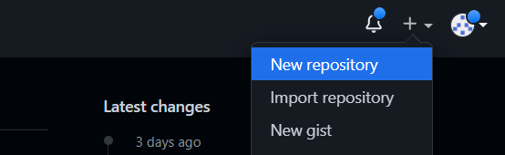
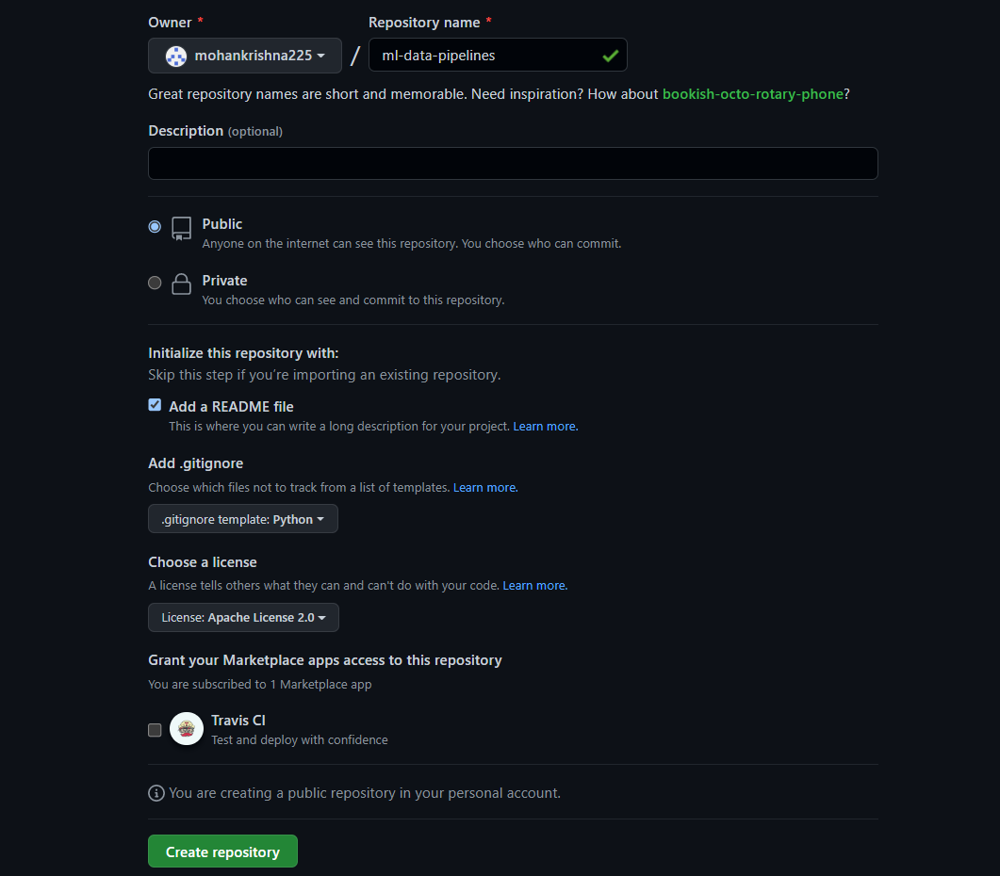
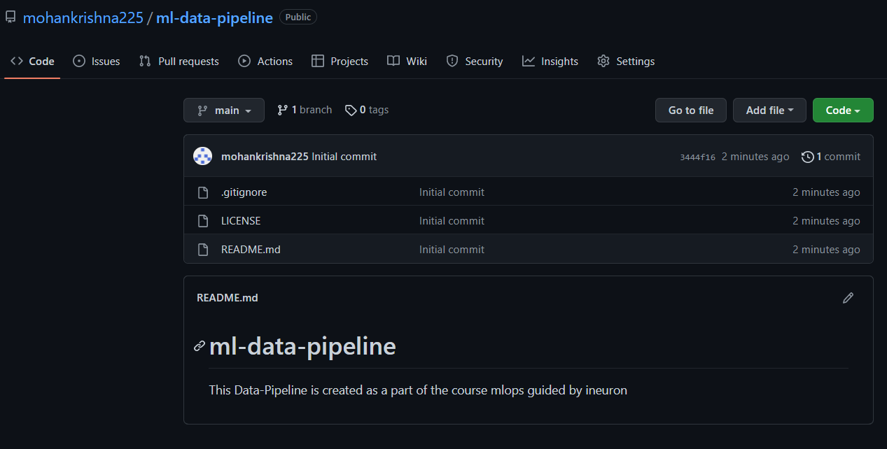
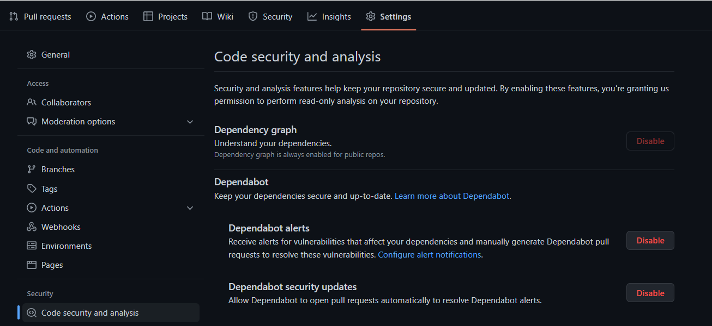
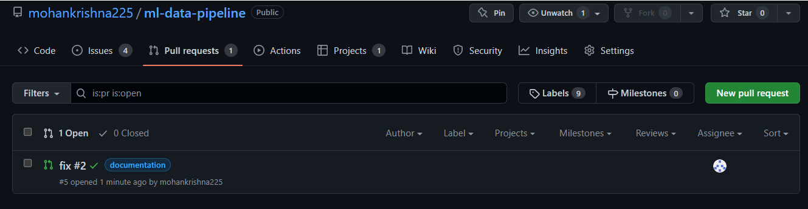
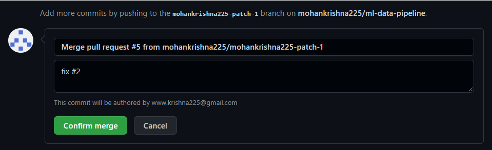

### Task 1:  Demonstrating Git commands


we can configure our user and email in our workspace using git config as shown above

Let's create a new repository for the current assignment ! 


 






Let's clone the created repository to our workspace using ```

```
git clone <repo url>
```


```
git remote -v
```

once the repo is clone we can check the remote repository url by above command

```
git log
```

we can check the activity of current repository using git log as show in above picture, It shows all information like who did what and when  
In above example  git logs show that Mohan Krishna has done an initial commit at date oct 17. 


Here we are trying to initialize the current local folder in our workspace as a git repo but since that we have cloned the repo already it shows as Reinitialized existing git repository


In above screenshot we tried to add a folder called sample_data by using 

```
git add <folder_name>
```

and save the changes locally in the repostory by using

```
git commit -m "your_meaningful_message"
```

After commiting the filed we can observe that it did added two new files to git repo and tracks them 


The above command is used to check the current status of repository on what files are being tracked and untracked, if files are modified any such will be tracked by git version control system

```
git status
```


Here we are creating a new branch called v1 and switching to it , by default main branch will be created when you initialize a github repository

```
git checkout -b "your_branch_name"
```

you can also just switch between branches using

```
git switch
```


```
git branch
```

git branch will list all the branches and * represents that it is the active branch you are in !


```
git ls-files 
```

This will show all files that are added to repository


The above command will  restore a specific historic revision of a file and  _unstage_ a certain file and thereby undo a previous `git add`, you need to provide the `--staged` flag


Here we have tried to add a requirements.txt file in branch v1 and commited it and then merged it to main branch using 

```
git merge <branch name>
```


Here we just summarized the activities done in the repositiory


Now since we have made some changes to local repo after cloning, it's time to push the local changes available in remote repo 

```
git push origin <branch name>
```

this will update the remote repository as well !


Since we have pushed some changed, meanwhile your teammates can push some changes, now it's time to get those changes to your local repo from remote repo so that we can work with the latest changes

```
git pull origin <branch name>
```




We have to enable dependabot to get alerts, we can enable it as shown above


And since we have made documentations and readme files in the repo we can host them as well using github pages 
Here is the hosted readme page for our project 

[https://mohankrishna225.github.io/ml-data-pipeline/](https://mohankrishna225.github.io/ml-data-pipeline/)


we can raise issue in the project if want to track the issue we can add it to a project and assign it a collobarator, and add labels so that we can track them in an organised manner 


Let's say that we made some changes after cloning the repo, we can push it to a  branch mohankrishna225-patch-1 as shown above and make a pull request so that a reviewer can review the codebase and docs, and push to correct branch later that is called merge request. you can delete the temp branch if needed after merging it 






![merge]merge%20success.png)


To release a project with certain branch and tag we can package them as a release in github 


FInally comes the project feature where we can create kanban boards to keep track of backlogs, issues, pull requests, and docs as a roadmap to the project 


