```
docker version
```

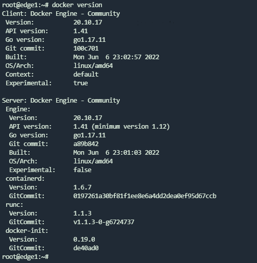

version will show us the client and server engine's version that is currently installed on the machine

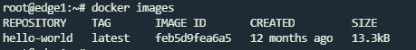

```
docker images
```

This will show images present on the machine

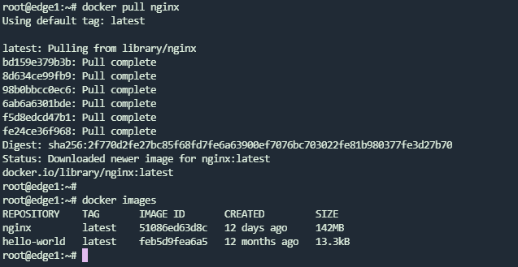

```
docker pull <image_name>
```

replace image_name with the name of registry/repo-name:tag, this will pull the image that is present in container registry like dockerhub.com, quay.io or your on-premises registry managed with harbor, we just have to follow the conventio for saving the image name.

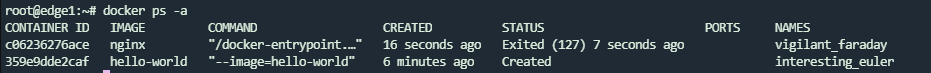

```
docker ps -a
```

this command will list all the containers that are present on the cluster


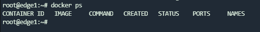

```
docker ps
```

without a ps will just show containers which are currently in running state alone

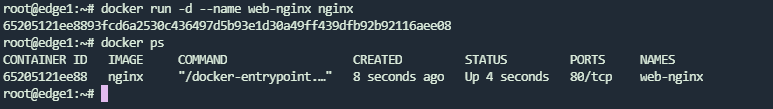

```
docker run -d --name web-nginx nginx
```

this command will run a container with image: nginx in detached mode with name being web-nginx


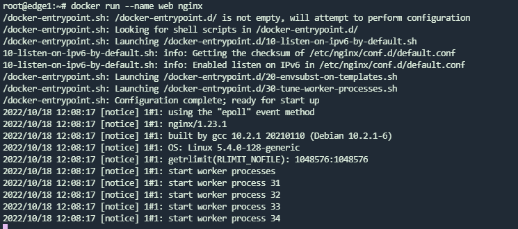

This command will run the container & we can see the logs as well after the container started

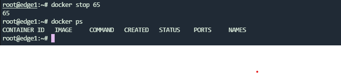

```
docker stop <container_id>
```

stop command will stop the container and make it to stopped state.

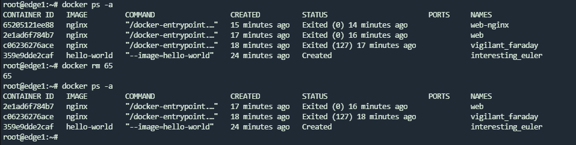

```
docker rm <container_id>
```

docker rm will remove the container from the machine

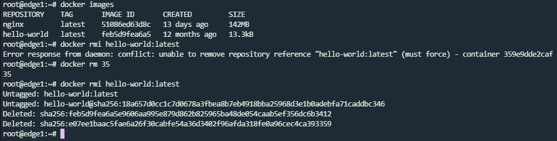

```
docker rmi <image_name>
```

docker rmi will remove the docker image from the machine

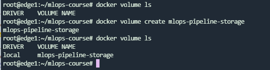

```
docker volume ls
```

this will list all the volumes present 

```
docker volume create <volume name>
```

this will create a volume for container to store data, we can attach this volume to a container like nginx and save html files 


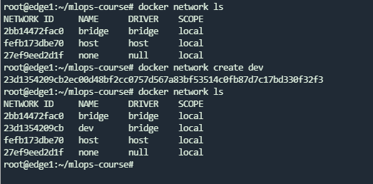

this command will create a new docker network where can isolate the containers networking in a separate network namespace

```
docker network create <name>
```

```
docker network ls
```

lists the networks present

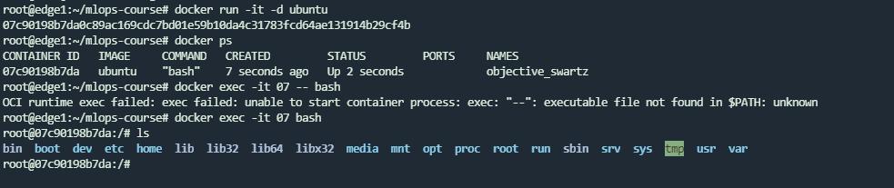

```
docker exec -it <container_id> bash
```

This is used to login to bash shell of container that is running, helpful in debugging 


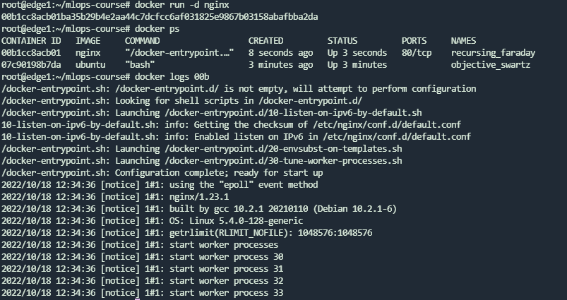


```
docker logs
```

this helps in viewing the container logs

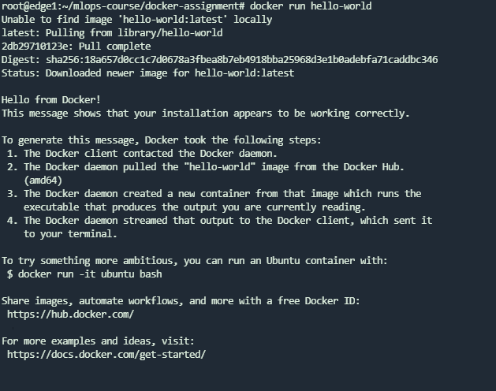

```
docker run hello-world
```

this download the image: hello-world from dockerhub and run as a container using docker engine on our machine

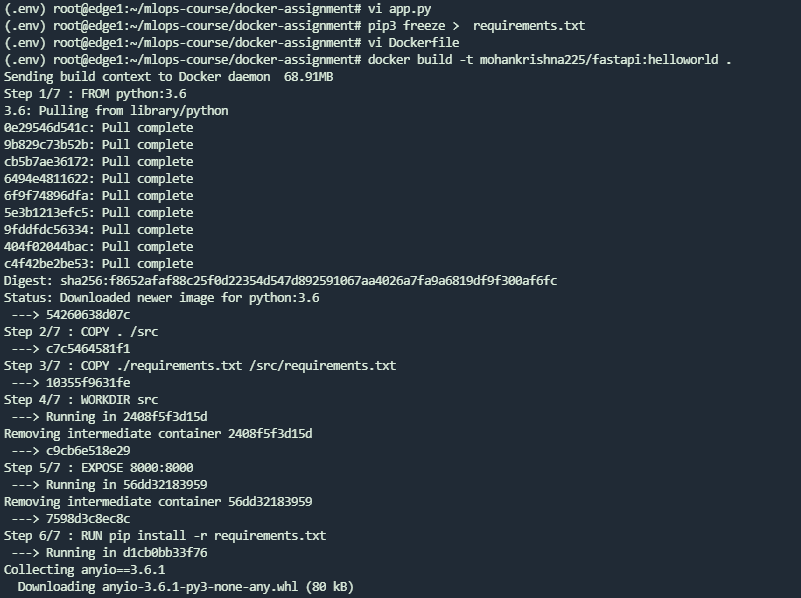

```
docker build -r <registry-name>/repo-name:tag-name
```

this helps us to build a docker image from Dockerfile and -t helps to tag it so that we can identify it and even version the same image with different tags

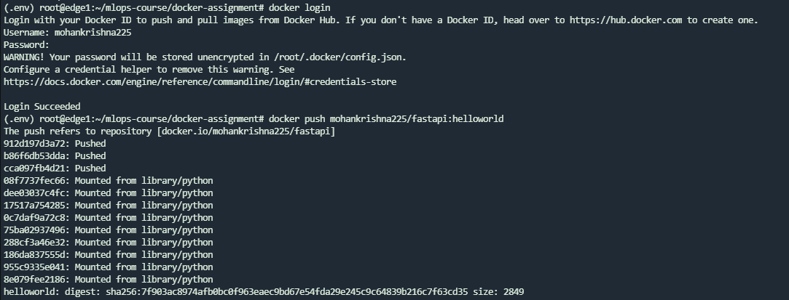

```
docker login
```

helps in logging to our repo at dockerhub.com so that we can pull or push to our repo

```
docker push <docker-image>
```

push will authenticate with our login credentials and upload the locally built image to dockerhub.com by default

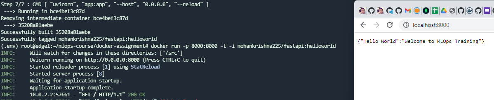

this is fastapi container running with base image: python3 and runnign our hello-world api on port number 8000


FastAPI Example Dockerfile


```
FROM python:3.8

COPY . /src

COPY ./requirements.txt /src/requirements.txt

WORKDIR src

EXPOSE 8000:8000

RUN pip install -r requirements.txt

#CMD [ "python", "app.py" ]

CMD [ "uvicorn", "app:app", "--host", "0.0.0.0", "--reload" ]
```


```
from fastapi import FastAPI

app = FastAPI()

@app.get("/")

def read_root():

return { "Hello World": "Welcome to MLOps Training" }

```

Docker Image: mohankrishna225/fastapi:helloworld

Repo: https://github.com/mohankrishna225/fastapi-docker


